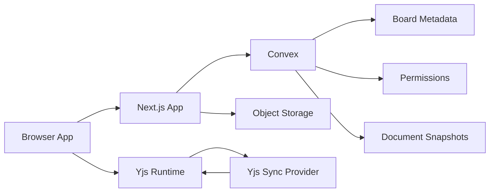
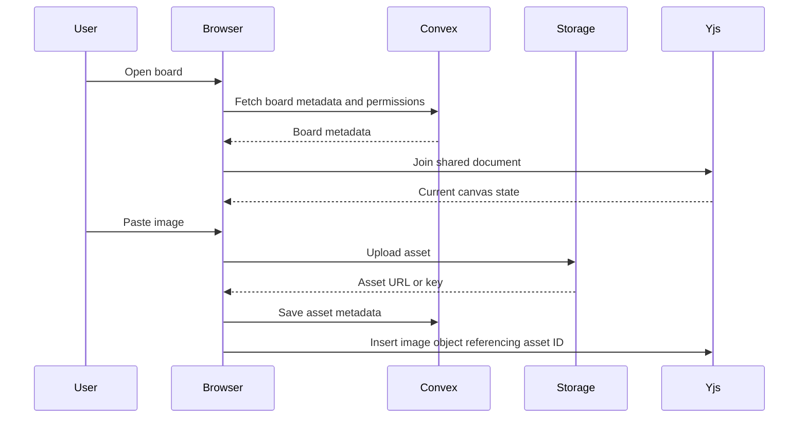

# Architecture

## Overview

The app should use Next.js for the web experience, Convex for backend product data, and Yjs for collaborative canvas state. The architecture separates durable application records from high-frequency collaborative document updates.

## Responsibilities

### Next.js

Next.js owns:

- App routing.
- Dashboard and board pages.
- Auth UI.
- Canvas shell and rendering components.
- Client-side Yjs document lifecycle.
- Upload and paste flows.
- Optimistic interface behavior.

### Convex

Convex owns:

- User-linked board records.
- Board metadata.
- Membership and permissions.
- Asset metadata.
- Server-side validation.
- Snapshot records for Yjs document persistence.
- Board list queries and mutations.

Convex should not be the transport for every cursor movement or object drag event. High-frequency collaboration belongs in the Yjs layer.

### Yjs

Yjs owns:

- Shared canvas object graph.
- Collaborative object edits.
- Shared selection state when appropriate.
- Undo/redo foundations.
- Conflict handling through CRDT behavior.

Yjs updates should be persisted through snapshots or incremental update storage. The exact persistence mechanism should be chosen after evaluating the selected sync provider.

### Asset Storage

Uploaded and pasted files should be stored outside the Yjs document. The Yjs canvas object should reference assets by ID, while Convex stores asset metadata.

Asset metadata includes:

- Owner.
- Board.
- MIME type.
- File size.
- Width and height.
- Storage key or URL.
- Created timestamp.

## Recommended Runtime Shape

## Auth

The app needs account-backed storage from the first release. The auth provider should integrate cleanly with Convex.

Candidate options:

- Convex Auth if it satisfies product needs.
- Clerk if social login, account management, and team-oriented auth are needed early.
- Auth.js if the project prefers open, framework-native control.

The docs should treat auth as a replaceable boundary until implementation starts.

## Canvas Rendering Layer

The renderer should support many positioned objects, smooth transforms, and direct manipulation.

Options to evaluate:

- `tldraw`: fastest route to mature canvas interactions, but may constrain custom product identity and data model.
- `Konva`: strong 2D canvas abstraction with React support.
- `PixiJS`: performant rendering, stronger for dense visual scenes, more custom work.
- Custom SVG/HTML hybrid: flexible for notes and DOM-like editing, but performance needs careful management.

Recommended initial decision: prototype with a custom scene model and evaluate `tldraw` only if it meaningfully accelerates collaboration and selection without fighting the desired product model.

## Persistence Strategy

Use a layered persistence model:

- Convex stores board metadata, permissions, assets, and document snapshot references.
- Yjs stores the collaborative object state.
- Object storage stores binary image files.
- Periodic snapshots protect against data loss and speed up board loading.

## Security Boundaries

- Every board operation must verify membership and role.
- Asset access must be scoped to board permissions.
- Viewer users must not publish Yjs updates.
- Upload limits should be enforced server-side.
- Public links should use scoped access tokens or link records, not raw board IDs alone.

