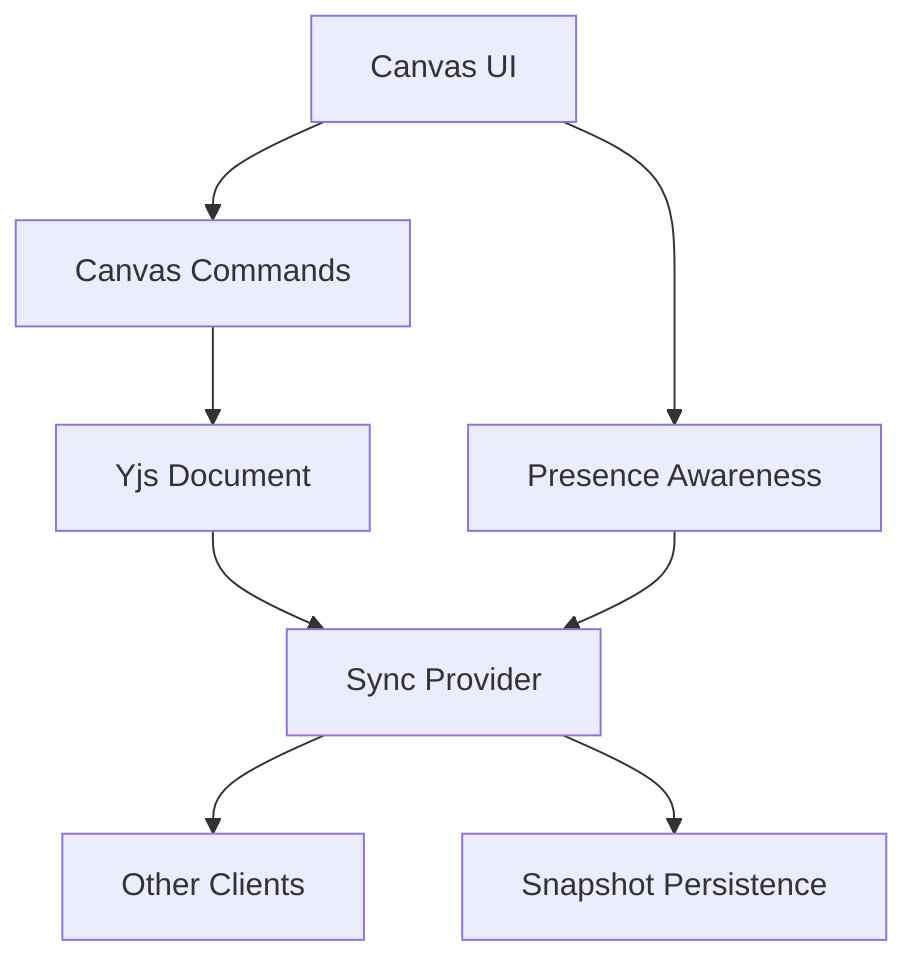

# Realtime Collaboration

## Goal

Realtime collaboration should eventually feel Figma-like: users can see each other, edit together, select objects, move content, and recover gracefully from conflicts or reconnects.

## Collaboration Layers

## Yjs Document Ownership

The Yjs document owns the shared canvas state:

- Object creation.
- Object movement.
- Object resizing.
- Text edits.
- Object deletion.
- Z-order changes.
- Grid visibility if it should sync across users.

Convex owns the app shell around the document:

- Board membership.
- User identity.
- Asset metadata.
- Snapshot records.
- Permission checks.

## Presence

Presence should use provider awareness rather than persisted document state.

Presence includes:

- Live cursor position.
- Selected object IDs.
- Active tool.
- User color.
- Display name.
- Last active timestamp.

Presence should disappear quickly when a user disconnects and should not create durable history.

## Conflict Behavior

Yjs handles low-level merge behavior, but the product still needs clear rules:

- Two users moving the same object should resolve to the latest merged state without corrupting the object.
- Text edits inside sticky notes should merge at text-operation level when possible.
- Deleted objects should disappear for all users.
- If an object is deleted while another user edits it, deletion wins and the editor should exit edit mode.
- Selection state should never block another user's edit in MVP.

## Undo And Redo

Undo/redo must be designed carefully in a collaborative app.

MVP behavior:

- Local undo applies to the current user's recent operations.
- Undo should not reverse unrelated changes made by collaborators.
- Object deletion undo should restore the object only if the document state allows it safely.

Later behavior:

- Per-user undo stacks.
- Version history.
- Restore points.
- Named snapshots.

## Persistence

The app should persist collaborative state through snapshots or update logs.

Recommended approach:

- Load the most recent snapshot when opening a board.
- Apply any later incremental updates if the selected provider supports them.
- Save snapshots periodically and after meaningful idle windows.
- Store snapshot metadata in Convex.
- Store large binary snapshot data in object storage if needed.

## Reconnect Behavior

When a client reconnects:

- Re-authenticate board access.
- Rejoin the Yjs sync session.
- Rehydrate awareness state.
- Apply missed updates.
- Show a subtle reconnecting state only if the delay is noticeable.

## Permissions

The sync layer must respect roles:

- Owners and editors can publish document updates.
- Viewers can subscribe to document and awareness updates but cannot mutate the document.
- Membership changes should invalidate active sessions when access is removed.

## MVP Realtime Checklist

- Join board session.
- Show active collaborators.
- Show live cursors.
- Show selected objects.
- Collaboratively create, move, resize, edit, and delete objects.
- Persist the document.
- Recover after reload.
- Prevent viewer edits.
