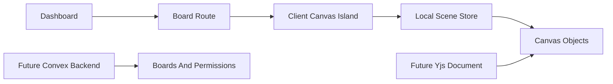

# Brainspill Milestone 1 Design

## Status

Approved design direction for an implementation-ready planning phase. This spec does not authorize coding by itself; it defines the first build milestone and the MVP roadmap that should guide the implementation plan.

## Product Intent

Brainspill is a desktop-first collaborative infinite canvas for creative moodboards and project whiteboarding. The long-term app will use Next.js, Convex, and Yjs, but the first milestone should validate the hardest product risk first: whether the canvas feels fast, calm, and useful.

The first build should feel like a quiet creative workspace. Notes, images, and stickers should carry the visual energy while the surrounding UI stays restrained.

## Visual Thesis

A witty, low-chrome creative surface where the workspace feels expansive and the interface stays almost invisible.

## Content Plan

- Dashboard: orient the user and make board creation obvious.
- Board workspace: make the canvas the main product surface.
- Empty canvas: invite the first action with utility copy.
- Inspector and toolbar: expose controls only when they help the current task.

## Interaction Thesis

- Pan and zoom should feel continuous, smooth, and spatially stable.
- Grid should subtly appear, fade, and remain useful across zoom levels.
- Object creation should feel immediate through click-to-place, clipboard paste, and local file selection.

## Approved Build Boundary

Use a two-layer spec:

- Milestone 1: detailed single-user canvas-first build.
- MVP roadmap: staged path for Convex persistence, Yjs collaboration, assets, permissions, snapshots, and sharing.

Milestone 1 is not the full collaborative MVP. It should produce a strong foundation that can later accept Convex and Yjs without rewriting the UI contract.

## Milestone 1 Scope

Milestone 1 includes:

- Next.js App Router scaffold.
- TypeScript strict mode.
- ESLint and formatting setup.
- shadcn/ui setup for product controls.
- Desktop-first app shell.
- Board dashboard with local board records.
- Board workspace route.
- Single-user infinite-feeling canvas.
- Smooth pan and zoom.
- Zoom reset and fit-to-view foundation.
- Blank/grid canvas toggle.
- Sticky note object creation.
- Basic image object placement through local file selection or clipboard paste.
- Object selection, move, resize, duplicate, and delete.
- Local scene store shaped for future Yjs migration.
- Basic keyboard shortcuts for delete, duplicate, and zoom reset.

Milestone 1 excludes:

- Realtime collaboration.
- Yjs sync provider integration.
- Convex persistence.
- Authentication enforcement.
- Asset storage service integration.
- Public sharing.
- Invite flows.
- Viewer permissions.
- Freehand drawing.
- Complex connector routing.
- Version history.
- Mobile or tablet editing.

## MVP Roadmap

### Milestone 2: Convex Foundation

Add Convex as the authoritative product backend for users, boards, memberships, asset metadata, and server-side permission checks. Move local dashboard records to Convex while keeping canvas object state local until the Yjs milestone.

### Milestone 3: Asset Pipeline

Add durable media upload, metadata, validation, and image dimensions. Store image bytes outside the canvas document and reference assets by stable IDs.

### Milestone 4: Yjs Collaboration

Move the canvas object graph into a Yjs document. Add a sync provider, live object updates, and provider awareness for cursors and selections. Keep Convex responsible for permissioned product data.

### Milestone 5: Persistence And Permissions

Add Yjs snapshot persistence, recovery behavior, role-aware sync access, owner/editor/viewer roles, and active session invalidation when access changes.

### Milestone 6: Sharing And Product Polish

Add invite flows, share links, board thumbnails, export, onboarding, shortcut help, and richer empty states.

## Architecture

Use Next.js App Router with a clear boundary between server-friendly product pages and the heavy client-side canvas workspace.




### Next.js

Next.js owns routing, app shell, dashboard, board workspace, metadata, font setup, and code splitting.

Dashboard pages should remain light and mostly server-friendly once persistence exists. The board workspace should be a client island because pointer interactions, viewport transforms, and local scene editing are browser-heavy.

### Canvas Runtime

Use a custom scene model for Milestone 1 instead of starting with `tldraw`. The custom model gives maximum control over the product feel and future data shape.

The hot path for pan, zoom, drag, and resize should not update React state every frame. Use refs, an external store, and `requestAnimationFrame` for continuous pointer interactions. React should update committed object state, toolbar state, inspector state, and other non-frame-critical UI.

### Convex Boundary

Convex is planned but not implemented in Milestone 1. The future Convex backend should own:

- Users.
- Boards.
- Memberships.
- Invites.
- Share links.
- Asset metadata.
- Upload limits.
- Board listing.
- Permission checks.
- Snapshot metadata.

Convex should not receive cursor movement, selection movement, drag ticks, resize ticks, or high-frequency canvas object streams.

### Yjs Boundary

Yjs is planned but not implemented in Milestone 1. The Milestone 1 scene object model should be compatible with a future Yjs map-based document:

- Stable object IDs.
- Flat object records.
- Explicit object type.
- Position and size fields.
- Per-type payload fields.
- Separate transient viewport and UI state.

Yjs should later own the collaborative canvas object graph, z-order, collaborative settings, and text/object edits. Provider awareness should own cursors, selections, active tools, and transient presence.

### shadcn/ui

Use shadcn/ui for product controls:

- Buttons.
- Dialogs.
- Tooltips.
- Dropdown menus.
- Input fields.
- Toolbar controls.
- Sheet or panel primitives if an inspector is needed.

Do not over-card the workspace. The canvas should remain visually dominant.

## Milestone 1 UX

### Dashboard

The dashboard should be calm and direct:

- App name.
- Create board action.
- Recent/local boards.
- Empty state when no boards exist.

The dashboard should not become a complex analytics-style page.

### Board Workspace

The board workspace should include:

- Full-window canvas.
- Compact toolbar.
- Grid toggle.
- Zoom controls or keyboard shortcuts.
- Minimal presence placeholder only if useful for future layout.
- Contextual inspector only when selection needs controls.

### Empty Canvas

Use utility copy:

> Paste an image, write a note, or turn on grid.

Avoid marketing copy inside the working surface.

## Milestone 1 Data Model

Use a local scene store with future migration in mind.

### Board

```ts
type Board = {
  id: string;
  title: string;
  createdAt: number;
  updatedAt: number;
};
```

### Canvas Object

```ts
type CanvasObject =
  | StickyNoteObject
  | ImageObject;

type CanvasObjectBase = {
  id: string;
  type: "stickyNote" | "image";
  x: number;
  y: number;
  width: number;
  height: number;
  rotation: number;
  zIndex: number;
  createdAt: number;
  updatedAt: number;
};
```

### Sticky Note

```ts
type StickyNoteObject = CanvasObjectBase & {
  type: "stickyNote";
  text: string;
  color: "yellow" | "pink" | "blue" | "green" | "white";
};
```

### Image

```ts
type ImageObject = CanvasObjectBase & {
  type: "image";
  src: string;
  fileName?: string;
  mimeType?: string;
  naturalWidth?: number;
  naturalHeight?: number;
};
```

### Viewport

Viewport state is local UI state, not part of the future collaborative document.

```ts
type CanvasViewport = {
  x: number;
  y: number;
  scale: number;
};
```

## Source Of Truth Rules

Milestone 1:

- Local scene store owns board objects.
- Local viewport store owns viewport transform.
- Local UI state owns selected object IDs and active tool.

Future milestones:

- Convex owns durable product records and permissions.
- Yjs owns collaborative object state.
- Provider awareness owns presence.
- Object storage owns binary assets.

Do not duplicate the same source of truth across Convex and Yjs.

## Performance Requirements

Milestone 1 should meet these targets:

- Pan and zoom remain smooth with at least 100 mixed objects.
- Continuous pan and zoom do not cause React commits every frame.
- Pointer move handling is scheduled with `requestAnimationFrame`.
- Object components are isolated so editing one object does not rerender the entire canvas.
- The board workspace is code-split away from the dashboard.
- Heavy future libraries such as Yjs providers, rich text editors, exporters, or image processors are not loaded on dashboard routes.
- Images use known dimensions where possible and avoid unnecessary full-resolution rendering when displayed small.

## Accessibility And Input

Milestone 1 should support:

- Mouse and trackpad navigation.
- Keyboard delete and duplicate.
- Keyboard zoom reset.
- Visible focus states for toolbar controls.
- Sufficient contrast for controls and notes.
- Reduced-motion-friendly UI transitions.

Screen reader support for spatial canvas content can be basic in Milestone 1, but controls should remain accessible.

## Error Handling

Milestone 1 errors are local:

- Invalid image file type should show a clear message.
- Failed image loading should show a recoverable object state or remove the failed object.
- Empty board state should guide the next action.
- Canvas operations should fail silently only when the requested action is impossible, such as deleting with no selection.

Future network, auth, upload, and collaboration errors belong to later milestones.

## Testing Plan

### Unit Tests

- Viewport transform math.
- Screen-to-canvas coordinate conversion.
- Object creation defaults.
- Object move and resize reducers.
- Object duplication.
- Object deletion.

### Integration Tests

- Create board and open workspace.
- Add sticky note.
- Edit sticky note text.
- Add image object.
- Paste image object from clipboard.
- Move and resize objects.
- Toggle grid.
- Use keyboard shortcuts.

### Manual Browser Checks

- Pan with mouse.
- Pan with trackpad.
- Zoom around cursor.
- Confirm grid readability at multiple zoom levels.
- Confirm canvas does not feel like it has a hard boundary.
- Confirm dashboard route remains lightweight compared with board route.

Realtime conflict, permission denial, reconnect, and persistence recovery tests start in later milestones.

## Implementation Constraints

- Follow Next.js App Router conventions.
- Keep client components limited to interactive surfaces.
- Avoid async client components.
- Use `next/image` for dashboard thumbnails once durable images exist.
- Use direct imports and route-level code splitting for heavy canvas modules.
- Use TypeScript strict mode and avoid `any`.
- Use shadcn/ui components for product UI where appropriate.
- Keep the canvas hot path outside React render loops.
- Keep Convex public functions thin and validated when Convex is added.
- Keep future Yjs updates batched and out of Convex mutation traffic.

## Acceptance Criteria

Milestone 1 is complete when:

- A user can create a local board.
- A user can open a board workspace.
- The canvas can pan and zoom smoothly.
- The user can toggle grid mode.
- The user can create, move, resize, duplicate, and delete sticky notes.
- The user can add, paste, move, resize, duplicate, and delete image objects.
- The scene object model is documented and compatible with future Yjs migration.
- The dashboard and board route are separated so heavy canvas code does not load on the dashboard.
- The implementation plan includes explicit later milestones for Convex, Yjs, assets, permissions, and persistence.

## Open Decisions Deferred From Milestone 1

- Auth provider: Convex Auth, Clerk, or Auth.js.
- Asset storage provider.
- Yjs sync provider.
- Yjs snapshot cadence and update-log retention.
- Viewer role and public share-link behavior.
- Collaborative undo/redo semantics.
- Freehand drawing implementation.
- Export formats beyond local prototype needs.

